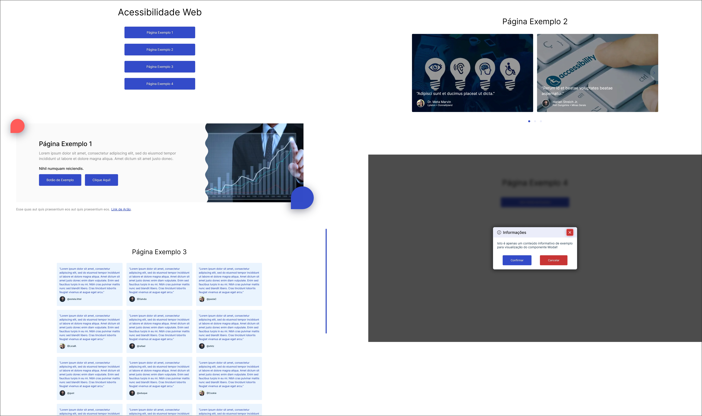
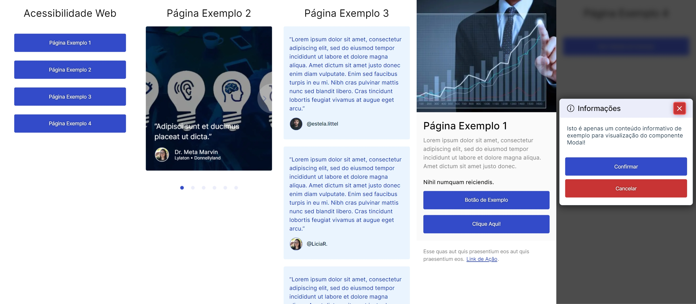

<div align="center">

<a href="./LICENSE"></a>


</div>

<h1 align="center">Acessibilidade</h1>

<br />

# :camera_flash: Screenshots do Projeto





# :memo: Sobre o Projeto

Este projeto procura aplicar boas práticas de acessibilidade web.

Para visualizar o projeto ‘online’ [clique aqui](https://accessibility.querocriarsite.com/).

<br />

---

# :globe_with_meridians: Tecnologias Usadas

⚛ Next.js

🔥 TypeScript

💅 Styled-Components

🚩 Lints — ESlint/Prettier/EditorConfig/Commitlint

✅ Jest e React Testing Library

📝 Storybook

📱 PWA

♿ Plugins para Acessibilidade: 
 - @storybook/addon-a11y 
 - eslint-plugin-jsx-a11y️

<br />

---

# :sparkles: Features

- [x] Projeto responsivo;

- [x] Acessível para navegação sem mouse e para leitores de tela;
  
- [x] Scroll infinito nos cards de comentários de redes sociais;
  
- [x] Componente de comentários que aceita dados de API;
  
- [x] Componente de banner para destaque de cards e imagens;
  
- [x] Transição entre páginas;
  
- [x] Load para aguardar carregamento via API;
  
- [x] Carrossel responsivo com animações e bullet indicativo de posição;
  
- [x] PWA instalável;

---

# :triangular_flag_on_post: Pré-Requisitos

- node

- yarn

<br />

---

# :question: Como instalar e executar o projeto

## Clonar Repositório:

```bash
git clone https://github.com/everton-dgn/accessibility.git
```

## Instalar Dependências:

```bash
yarn
```

## Inciar Ambiente de Desenvolvimento:

```bash
yarn dev
```

Disponível em http://localhost:3000

## Gerar Build de Produção:

```bash
yarn build
```

## Inciar Ambiente de Produção:

```bash
yarn start
```

Disponível em http://localhost:3000

## Executar Testes:

```bash
yarn test
```

## Executar Testes em Modo Watch:

```bash
yarn test:w
```

## Inciar Storybook em Modo de Desenvolvimento:

```bash
yarn sb
```

Disponível em http://localhost:6006

## Gerar Build de Produção do Storybook:

```bash
yarn build-sb
```

## Executar lints:

```bash
yarn lint
```

```bash
yarn next:lint
```

<br />

---

# :closed_book: Autor

Feito por [Éverton Toffanetto](https://querocriarsite.com).

### :link: LinkedIn: https://www.linkedin.com/in/everton-toffanetto/
